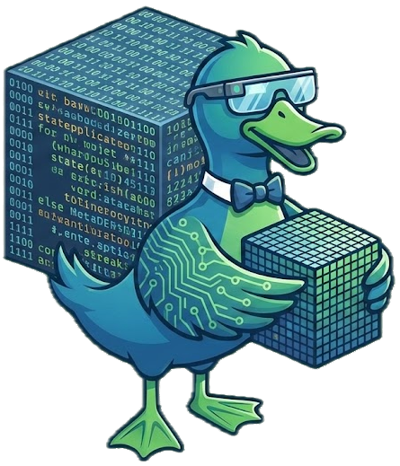
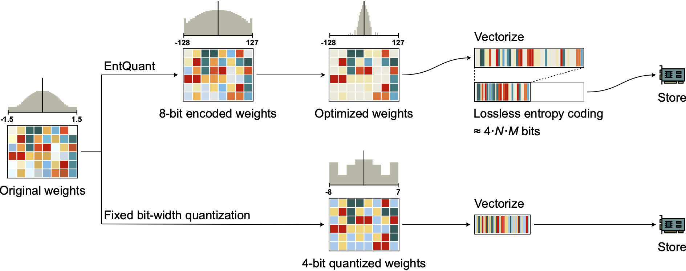

<h1 align="center">EntQuant</h1>
<p align="center"><b>Entropy Coding Meets Quantization</b></p>

<p align="center">
    
</p>

<p align="center">
    <a href="https://arxiv.org/abs/2601.22787"></a>
    <a href="LICENSE"></a>
</p>

<p align="center">
📦 <b>Extreme compression</b> - Down to 2 bits/parameter, while retaining full 8-bit dynamic range<br>
🔬 <b>Data-free</b> - No calibration, no recovery training, works on any model out of the box<br>
⚡ <b>Fast</b> - Compresses a 70B model on a single GPU in <10 minutes, as you load it from disk<br>
🏃 <b>Inference-ready</b> - On-the-fly GPU decompression integrated into the inference pipeline
</p>

## 🔍 What is EntQuant?

Standard post-training quantization (PTQ) couples compression rate to bit-width: 4-bit means exactly 16 unique values,
2-bit means only 4. Without great care, pushing to lower bit-widths directly destroys model quality because so few
distinct weight values remain.

EntQuant breaks this coupling. It keeps weights in a high-precision 8-bit format (Float8 or Int8) but optimizes their
distributions for low *entropy*, that is, it encourages weights to cluster around a small number of frequent values
without discarding the ability to represent outliers. A GPU-accelerated ANS codec then losslessly compresses the
resulting low-entropy distributions to far fewer bits per parameter than the original 8. This decouples numerical
precision from
storage cost: you get the expressiveness of 8-bit with the size of 2-4-bit.

At the extreme, EntQuant achieves effective bit rates down to ~2 bits per parameter while retaining far more unique
weight values than a fixed 2-bit representation (see Table 1 in the [paper](https://arxiv.org/pdf/2601.22787)). No
calibration data or recovery training is
required. The method works on any model out of the box, including instruction-tuned and reasoning models.

<p align="center">
    
</p>

This work was developed at [Merantix Momentum](https://merantix-momentum.com).
If you are using it, [please cite it](#citation).

> 📜 [**Float8@2bits: Entropy Coding Enables Data-Free Model Compression**](https://arxiv.org/abs/2601.22787) </br>
> *Patrick Putzky\*, Martin Genzel\*, Mattes Mollenhauer, Sebastian Schulze, Thomas Wollmann, Stefan Dietzel* </br> \*
> equal
> contribution <br>

## 🚀 Quick Start

### Installation

Clone the repo and install dependencies with [uv](https://docs.astral.sh/uv/) (Python >= 3.11, CUDA GPU required):

```bash
git clone https://github.com/merantix-momentum/entquant.git
cd entquant
uv sync
```

> ❗ EntQuant requires [NVIDIA nvCOMP](https://developer.nvidia.com/nvcomp) (tested with version 5.1.0) for the ANS
> compression
> backend. Set the `NVCOMP_ROOT` environment variable (or add it to a `.env` file) pointing to the extracted directory.
> A
> CUDA toolkit (`nvcc`) is also needed since the backend is JIT-compiled on first use. You can pre-compile it with
`uv run python scripts/compile_backend.py`.

### Usage Walkthrough

This section walks you through [`scripts/quickstart.py`](scripts/quickstart.py) step by step. You can run it directly
with
`uv run python scripts/quickstart.py`.

**Step 1 - Choose model and dtype:**

```python
import torch
from entquant import EntQuantModel
from entquant.quantization.optimizer import SymmetricEntropyOptimizer, WrappedAbsmaxOptimizer

MODEL = "meta-llama/Llama-2-7b-hf"
DTYPE = torch.bfloat16
WEIGHT_QTYPE = "qfloat8"  # or "qint8"
```

`WEIGHT_QTYPE` selects the quantization format. `"qfloat8"` (FP8 E4M3) is the default; `"qint8"` is also supported.

**Step 2 - Set the target bit rate:**

```python
LAMBDA, LR = 3.9, 1.0  # ~ 4-bit
# LAMBDA, LR = 14.5, 1.0  # ~ 3-bit
# LAMBDA, LR = 58.0, 0.25 # ~ 2-bit
```

`LAMBDA` is the entropy regularization strength and `LR` is the optimizer learning rate. Together they control how
aggressively the weight distribution is pushed toward low entropy (= higher compressibility). Higher `LAMBDA` = more
compression. This is the key knob unique to EntQuant - unlike standard PTQ methods, the target bit rate is continuously
tunable and not tied to a fixed integer bit-width. The above choices are robust across all models we tested, so the same
`(LAMBDA, LR)` pair can be reused for different architectures and base model sizes.

**Step 3 - Quantize + compress:**

```python
model = EntQuantModel.from_pretrained(
    MODEL,
    quantize=True,
    compress=True,
    weight_qtype=WEIGHT_QTYPE,
    dtype=DTYPE,
    optimizer=SymmetricEntropyOptimizer(lr=LR, reg_param=LAMBDA),
    optimizer_fallback=WrappedAbsmaxOptimizer(),
)
```

`quantize=True` triggers block-streaming quantization & EntQuant optimization (the base model is never fully
materialized in memory).
`compress=True`
additionally runs ANS compression. `optimizer_fallback` is used for fallback layers (e.g., layers with super weights
that need simple 8-bit quantization).

**Step 4 - Save and reload:**

```python
model.save_pretrained("artifacts/my-checkpoint")

# Later: load back with decompression
model = EntQuantModel.from_pretrained("artifacts/my-checkpoint", compress=True)
```

Checkpoints store the quantized (but not compressed) weights. ANS compression is performed on the fly when loading from
disk - it is fast enough to add negligible overhead.

See [`scripts/quickstart.py`](scripts/quickstart.py) for the full runnable script, which also supports multi-GPU, super
weight detection, and inference benchmarks.

## ⚙️ Hydra-zen API & CLI

For batch experiments and reproducible configs, EntQuant provides
a [hydra-zen](https://mit-ll-responsible-ai.github.io/hydra-zen/) pipeline.

**Basic command:**

```bash
uv run python -m run.workflows.exec +experiment=entquant_fp8 cfg/model=llama2_7b
```

**Useful Hydra CLI flags:**

- `--help` to discover available config groups and overrides
- `--cfg job` to print the fully resolved config without running
- Override individual parameters on the CLI, e.g.:
  ```
  cfg.entquant.optimizer.reg_param=14.5 cfg.entquant.optimizer.lr=1.0
  ```

See [`run/conf/model.py`](run/conf/model.py) for the full list of available model configs. You can add new ones there if
you like.

## 📜 Paper Experiments

All commands to reproduce the paper results are collected in [`scripts/commands.txt`](scripts/commands.txt). These use
the hydra-zen pipeline described above.

## 🏗️ Code Structure

```
entquant/
  model/          # EntQuantModel, block-streaming, checkpoint I/O
  quantization/   # Entropy optimizer to compute quantization scales (Float8/Int8)
  compression/    # ANS compression via nvCOMP, GPU decompression hooks
  super_weights/  # Super weight detection for fallback layer selection
  eval/           # Perplexity, lm-eval-harness, inference benchmarks
run/
  conf/           # Hydra-zen structured configs (model, entquant, eval, ...)
  workflows/      # Build, evaluation, experiment definitions, exec entry point
scripts/          # Standalone scripts (quickstart, commands, etc.)
tests/            # Basic integration tests (requires CUDA)
```

Design notes:

- **`EntQuantModel`** is the sole public entry point, following the PeftModel pattern (`nn.Module` + `PushToHubMixin`).
  It wraps a standard HuggingFace model and manages quantization, compression, and serialization.
- **Block-streaming** architecture: the full (uncompressed) model is never materialized in memory. Weights are
  quantized, compressed,
  and saved block-by-block.
- **`optimum-quanto`** provides the quantization primitives (`QLinear`, `WeightQBytesTensor`). EntQuant adds a custom
  low-entropy scale optimizer that minimizes the L1 norm as a differentiable proxy for Shannon entropy.
- **nvCOMP ANS** compression with on-the-fly GPU decompression: compressed weights are stored as byte buffers and
  decompressed into a shared device buffer just before each block's forward pass.

## 📬 Contact

Feel free to reach out to us via GitHub issues or email! <br>
`patrick.putzky at merantix-momentum dot com` <br>
`martin.genzel at merantix-momentum dot com`

## 📝 License

This project is released under the Apache 2.0 license. Please see the [LICENSE](LICENSE) file for more information.

<a id="citation"></a>

## 📖 Citation

When using or referring to this project, please cite our [paper](https://arxiv.org/abs/2601.22787):

```bibtex
@article{putzky2026entquant,
    title = {Float8@2bits: Entropy Coding Enables Data-Free Model Compression},
    author = {Putzky, Patrick and Genzel, Martin and Mollenhauer, Mattes and Schulze, Sebastian and Wollmann, Thomas and Dietzel, Stefan},
    year = {2026},
    journal = {Preprint arXiv:2601.22787}
}
```

## 🙏 Acknowledgements

We kindly acknowledge funding by the European Union - NextGenerationEU - and the German Federal Ministry for Economic
Affairs and Energy in the project "Souveräne KI für Europa (SOOFI)" (grant no. 13IPC040H).
